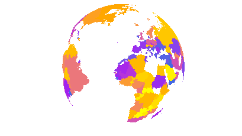

<!-- mapmate.md is generated from README.Rmd. Please edit that file -->

```{r, echo = FALSE}
knitr::opts_chunk$set(collapse=TRUE, comment="#>", message=F, warning=F, error=F, eval=F, tidy=T) # for html_vignette only
#knitr::opts_chunk$set(collapse=TRUE, comment="#>", message=F, warning=F, error=F, eval=F, tidy=T, fig.width=0.8*5.33, fig.height=0.8*3) # for html_document only
```

The `mapmate` package is used for map- and globe-based data animation pre-production.
Specifically, `mapmate` functions are used to generate and save to disk a series of map graphics that make up a still image sequence,
which can then be used in video editing and rendering software of the user's choice. This package does not make simple animations directly within R, which can be done with packages like `animation`.
`mapmate` is more specific to maps, hence the name, and particularly suited to 3D globe plots of the Earth.
Functionality and fine-grain user control of inputs and outputs are limited in the current package version.

This introduction covers the following toy examples:

- Generate a data frame containing monthly map data (optionally seasonal or annual aggregate average data)
in the form of an n-year moving or rolling average based on an input data frame of raw monthly data.
- Generate a sequence of still frames of:
    - map data for use in a flat map animation.
    - dynamic/temporally changing map data projected onto a static globe (3D Earth)
    - static map data projected onto rotating globe
    - dynamic map data projected onto rotating globe
- Parallel processing examples using `mclapply`
- Convenient iterator wrapper function
- Comparison of map tiles, map lines, and polygons
- Non-map data example (time series line growth)

Other features and functionality will be added in future package versions.

## Computing moving averages

With a data frame containing monthly map data in the following form, a data frame of moving averages can be computed using `get_ma`.
The n-year moving average window is controlled by `size`.
The window size pertains to years whether the original monthly data remain as monthly data or are summarized on the fly to seasonal or annual averages.

```{r, eval=TRUE}
library(mapmate)
library(dplyr)
library(purrr)
data(monthlytemps)
monthlytemps

get_ma(monthlytemps, type="seasonal", season="winter")

get_ma(monthlytemps, type="annual", size=20)
```

## Generate a still image sequence

To keep the data size minimal, the `monthlytemps` data set only includes data from one map cell, which is sufficient for the moving average example.
But for mapping we need more complete map data.
The `annualtemps` dataset below is not subsampled, though it is highly spatially aggregated as well as consisting of annual averages of monthly data.
This made it small enough to not be a burden to include in the package, but complete enough to use for mapping examples.

```{r, eval=TRUE}
data(annualtemps)
annualtemps
```

The function below saves png files to disk as a still image sequence. Set your working directory or be explicit about your file destination.
Make sure to obtain the range of data across not only space (a single map) but time (all maps).
This is to ensure a constant color to value mapping with your chosen color palette across all maps in the set of png files.
For simplicity, set the number of still frames to be equal to the number of unique time points in the data frame, in this one frame for each year.

Since each point in this data frame represents a coarse grid cell, we use `type="maptiles"` in the call to `save_map`.
`save_map` is used for tiles, polygon outlines (`type="maplines"`), polygon fill (`type=="polygons"`), and great circle arcs (`type="network"`).
One of these four types must be specified and the data must be appropriate for the type.

Tiles are the simplest, but while we are working with data frames, the data typically would originate from a rasterized object, hence the nice even spacing of the coordinates.
Last of all, but important, the data frame must contain a column of still frame sequence IDs or plot number IDs.
This variable is simply the integers `1, 2, ..., n` for `n` frames or individual plots and is used for subsetting data for each plot and for sequential numbering of output files.
It can have any name. Here it is called `frameID` and is computed baed on the unique years in the example data frame.
It is passed to `save_map` via the `id` argument.

For these static examples, arguments pertaining specifically to image sequences can be ignored for now (`n.period`, `n.frames`, `z.range`)
and since we are not saving files to disk we can also ignore arguments like `dir` and `suffix`, but we will return to all these immediately after.

### Initial static 2D and 3D map examples

```{r, eval=TRUE, fig.show='hold', fig.cap="2D flat map and 3D globe"}
library(RColorBrewer)
pal <- rev(brewer.pal(11,"RdYlBu"))
temps <- mutate(annualtemps, frameID = Year - min(Year) + 1)
frame1 <- filter(temps, frameID==1) # subset to first frame
id <- "frameID"

save_map(frame1, z.name="z", id=id, ortho=FALSE, col=pal, type="maptiles", save.plot=FALSE, return.plot=TRUE)
save_map(frame1, z.name="z", id=id, col=pal, type="maptiles", save.plot=FALSE, return.plot=TRUE)

```

### Flat map sequence

#### Dynamic data, static map

`save_map` is not typically used in the manner above. The above examples are just to show static plot output,
but there is no convenience in using `mapmate` for that when we can just use `ggplot2` or other plotting packages directly.
Below are some examples of how `save_map` is usually called as a convenient still image sequence generator.

Notice the importance of passing the known full range of the data.
The optional filename `suffix` argument is also used.
For a flat map we still do not need to pay attention to the globe-specific arguments (`lon`, `lat`, `rotation.axis`)
and those dealing with displaying data while globe rotation occurs across the image sequence can also be ignored (`n.period`).

```{r}
rng <- range(annualtemps$z, na.rm=TRUE)
n <- length(unique(annualtemps$Year))
suffix <- "annual_2D"
temps <- split(temps, temps$frameID)
walk(temps, ~save_map(.x, z.name="z", id=id, ortho=FALSE, col=pal, type="maptiles", suffix=suffix, z.range=rng))

```

### Globe sequence

#### Dynamic data, static map

For plotting data on the globe, set `ortho=TRUE` (default).
In this example the globe remains in a fixed position and orientation.
The default when passing a single, scalar longitude value to the `lon` argument is to use it as a starting point for rotation.
Therefore, we need to pass our own vector of longitudes defining a custom longitude sequence to override this behavior.
Since the globe is to remain in a fixed view, set `lon=rep(-70, n)`.
Note that a scalar `lat` argument does not behave as a starting point for rotation in the perpendicular direction so not explicitly repeating vector is needed.

Also pay attention to `n.period`, which defines the number of frames or plot iterations required to complete one globe rotation (the degree increment).
`n.period` can be any amount when providing a scalar `lon` value. The longitude sequence will propagate to a length of `n.period`.
However, if providing a vector representing a custom path sequence of longitudes to `lon`, there is no assumption that the sequence is meant to be cyclical (do your own repetition if necessary).
It could just be a single pass, custom path to change the globe view.
In this case, `n.period` must be equal to the length of the `lon` and `lat` vectors or an error will be thrown.
This is more a conceptual restriction than anything.
With a custom path defined by `lon` and `lat` vectors, which may not be at all cyclical, it only makes sense to define the period as the length of the sequence itself.


```{r}
suffix <- "annual_3D_fixed"
walk(temps, ~save_map(.x, z.name="z", id=id, lon=rep(-70, n), lat=50, n.period=n, n.frames=n, col=pal, type="maptiles", suffix=suffix, z.range=rng))

```

#### Static data, dynamic map

Now let the globe rotate, drawing static data on the surface.
In this example the nation borders are drawn repeatedly while allowing the Earth to spin through the still image sequence from frame to frame.
`walk` from the `purrr` package is used to easily duplicate the `borders` data frame in a list while adding an plot number ID column that increments over the list.

It's quite redundant and this is worse if the dataset is large, but this is how `save_map` currently accepts the data.
Fortunately, it would make little difference if the data change from frame to frame, which is the main purpose of `save_map`.
Datasets which do not vary from frame to frame generally serve the role of providing a background layer to other data being plotted,
as with the nation borders here and as we will see later with a bathymetric surface.

In the case of repeating data passed to `save_map`, it only makes sense when plotting on a globe and when using a perspective that has some kind of periodicity to it.
This limits how many times the same data must be redrawn.
For example, if the Earth completes one rotation in 90 frames, it does not matter that maps of time series data may be plotted over a course of thousands of frames.
When layering those maps on top of a constant background layer on the rotating globe, only 90 plots of the background data need to be generated.
Those 90 saved images can be looped in a video editor until they reach the end of the time series maps image sequence.

The plot type has changed to `maplines`.
`z.range` can be ignored because it only applies to map tiles (essentially square grid polygon fill coloring) which have values associated with surface pixels.
It is irrelevant for polygon outlines as well as for `type="network"` plots of line segment data.
A single color can be used for the lines so the previously used palette for tiles has been replaced.

```{r}
data(borders)
borders <- map(1:n, ~mutate(borders, frameID = .x))
suffix <- "borders_3D_rotating"
walk(borders, ~save_map(.x, id=id, lon=-70, lat=50, n.period=30, n.frames=n, col="orange", type="maplines", suffix=suffix))

```

Using one more example, return to the list of annual temperature anomalies data frames used previously.
Those were used to show changing data on a fixed-perspective globe plot.
Here we plot the first layer, repeatedly, as was just done with the `borders` dataset, allowing the Earth to rotate.
Remember to update the plot ID values.
The key difference with this example of fixed data and a changing perspective is that providing `z.range` is crucial to maintaining constant color mapping.

```{r}
temps1 <- map(1:n, ~mutate(temps[[1]], frameID = .x))
rng1 <- range(temps1[[1]]$z, na.rm=TRUE)
suffix <- "year1_3D_rotating"
walk(temps1, ~save_map(.x, z.name="z", id=id, lon=-70, lat=50, n.period=30, n.frames=n, col=pal, type="maptiles", suffix=suffix, z.range=rng1))

```

#### Dynamic data, dynamic map

Finally we have the case of changing data drawn on a map with a changing perspective.
This example plots the full time series list of annual temperature anomalies data frames with globe rotation.

```{r}
suffix <- "annual_3D_rotating"
walk(temps, ~save_map(.x, z.name="z", id=id, lon=-70, lat=50, n.period=30, n.frames=n, col=pal, type="maptiles", suffix=suffix, z.range=rng))

```

Of course, there is no reason to draw static data on a static flat map or static (e.g., non-rotating) globe
because that would yield a still image sequence of a constant image.
The utility of the function is in generating a series of plots where either the data changes, the perspective changes, or both.

### Multiple image sequences

Putting it all together, we can generate three still image sequences to subsequently be layered on top of one another in an animation.
Below is an example using a bathymetry surface map as the base layer, the temperature anomalies that will be the middle layer,
and the nation borders which will stack on top. This also is why the saved png images have a default transparent background.
There is an expectation of eventual layering.

```{r}
data(bathymetry)
bath <- map(1:n, ~mutate(bathymetry, frameID = .x))
rng_bath <- range(bath[[1]]$z, na.rm=TRUE)
pal_bath <- c("black", "steelblue4")

walk(bath, ~save_map(.x, z.name="z", id=id, n.frames=n, col=pal_bath, type="maptiles", suffix="background", z.range=rng_bath))
walk(borders, ~save_map(.x, id=id, n.frames=n, col="black", type="maplines", suffix="foreground"))
walk(temps, ~save_map(.x, z.name="z", id=id, n.frames=n, col=pal, type="maptiles", suffix="timeseries", z.range=rng))

```

### Parallel processing

For larger datasets and longer sequences, this is much faster the more it can be parallelized.
`mapmate` is designed to add convenience for making relatively heavy duty animations.
The emphasis is on images which will look sharp and lend themselves to smooth frame transitions.
They may also do so while displaying a large amount of data.
High-resolution images (even larger than 4K) can be used to allow zooming during animations without loss of quality.
For all these reasons, processing large amounts of data and generating still image sequences can take a long time
depending on how large, long, and complex the desired plots sequences are.

The toy examples given earlier are not ideal for serious production.
The code is provided for simple reproduction and tutorial purposes.
The `save_map` function can be used more powerfully on a Linux server with a large number of CPU cores,
and enough RAM to meet the needs of your data.
It uses `mclapply` from the base R `parallel` package.
It will not work on Windows.
The choice was made for convenience.

The example below is like the previous one, but using `mclapply`.
It assumes you have a 32-CPU Linux server node.
If you have multiple nodes, you could even go so far as to explore the `Rmpi` package to link across, say, 10 nodes to yield the power of 320 CPUs.
But if you have access to that kind of computing power, you probably already know it and can explore it on your own.
It is beyond the scope of this tutorial.

```{r}
library(parallel)
mclapply(bath, save_map, z.name="z", id=id, n.frames=n, col=pal_bath, type="maptiles", suffix="background", z.range=rng_bath, mc.cores=32)
mclapply(borders, save_map, id=id, n.frames=n, col="orange", type="maplines", suffix="foreground", mc.cores=32)
mclapply(temps, save_map, z.name="z", id=id, n.frames=n, col=pal, type="maptiles", suffix="timeseries", z.range=rng, mc.cores=32)

```

### Iterator wrapper function

The `save_seq` function is a convenient wrapper around both `save_map` and `save_ts` (documented further below).
It also provides the option to process in parallel (on Linux systems only, via `parallel::mclapply`) with the `use_mclapply` argument.
This wrapper function allows for passing the entire data frame,
handling the breaking into a list of data frame subsets by plot ID internally.
This spares the user from having to explicitly call functions like `map` and `walk` directly and moves some of this data preparation work into `save_seq`.

The serial and parallel equivalents to the previous examples is shown below.
It won't always save much in the way of gross typing because the wrapper is used to pass along the same arguments that would otherwise be passed to `save_map` or `save_ts` directly,
along with some of its own arguments.
But it allows focusing on calling a single plotting iterator function instead of requiring iteration be done explicitly, the iterative aspect being abstracted away to some small degree.
Since the function is primarily used for map sequences, `style="map"` is the default. Later we will see `style="tsline"` for time series line growth sequences.

```{r}
# Serial
save_seq(bath, z.name="z", id=id, n.frames=n, col=pal_bath, type="maptiles", suffix="background", z.range=rng_bath)
save_seq(borders, id=id, n.frames=n, col="black", type="maplines", suffix="foreground")
save_seq(temps, z.name="z", id=id, n.frames=n, col=pal, type="maptiles", suffix="timeseries", z.range=rng)

# Parallel, Linux, with 32 CPU cores available
save_seq(bath, use_mclapply=TRUE, mc.cores=32, 
  z.name="z", id=id, n.frames=n, col=pal_bath, type="maptiles", suffix="background", z.range=rng_bath)
save_seq(borders, use_mclapply=TRUE, mc.cores=32, 
  id=id, n.frames=n, col="black", type="maplines", suffix="foreground")
save_seq(temps, use_mclapply=TRUE, mc.cores=32, 
  z.name="z", id=id, n.frames=n, col=pal, type="maptiles", suffix="timeseries", z.range=rng)

```

### Polygon fill and limitations

Previous examples made use of `type="maptiles"` and `type="maplines"`.
Here is an example using `type="polygons"`. While polygon borders were drawn earlier with `maplines`,
they didn't need to be polygon borders and could have been any data suitable to be passed on to `ggplot2::geom_path`.
In the example below, a data frame originating from a `SpatialPolygonsDataFrame` is expected and the intent is to fill polygons with colors based on data values.
A convenient example can be shown making use of the `rworldmap` package.

```{r}
library(rworldmap)
library(rworldxtra) # required for "high" resolution map
library(maptools) # required for fortify to work
# also recommend installing rgeos

spdf <- joinCountryData2Map(countryExData, mapResolution="high")
spdf@data$id <- rownames(spdf@data)
bio <- ggplot2::fortify(spdf, region="id") %>%
  left_join(subset(spdf@data, select=c(id, BIODIVERSITY)), by="id")
n <- 30
bio <- map(1:n, ~mutate(bio, frameID = .x) %>% rename(lon=long))
suffix <- "bioDivPolygons_3D_rotating"
x1 <- "BIODIVERSITY"
clrs <- c("royalblue", "purple", "orange", "yellow")

# Return a test map
save_map(bio[[1]], z.name=x1, id=id, lon=0, lat=20, n.period=n, n.frames=n, col=clrs, type="polygons", suffix=suffix, save.plot=FALSE, return.plot=TRUE)
```

<!-- -->

```{r}
# Walk over all maps
walk(bio, ~save_map(.x, z.name=x1, id=id, lon=0, lat=20, n.period=n, n.frames=n, col=clrs, type="polygons", suffix=suffix))

```

Note that `type="polygons"` will work poorly for the orthogrpahic projection. Nation polygons will be clipped at varying points as the globe rotates,
leading to moving artifacts around the perimeter of the visible hemisphere. In the view above, this is clear over North America.
There is no work around implemented for this within `save_map` when using `type="polygons"` on a globe.
As a result, it is recommended to only use world polygons with flat maps.

The external work around is to rasterize source polygon data, e.g. from a `SpatialPolygonsDataFrame` to a satisfactorily high resolution
and plot the rasterized grid cells data frame using `type="maptiles"`.
See the earlier examples using the `annualtemps` data set for an introduction to the use of tiles.
Of course, this will lead to greater processing time, as `geom_tile` from `ggplot2` is essentially plotting many tiny square polygons
rather than the small number of larger polygons in the original data if using `geom_polygon`.
The version using tiles is below. Tiles are one sqaure degree, which will still appear a somewhat coarse resolution.
Much higher resolutions are painfully slow to render with `geom_tile`.

```{r}
library(raster)
proj4 <- "+proj=longlat +datum=WGS84 +no_defs +ellps=WGS84 +to wgs84=0,0,0"
r <- raster(extent(-180,180,-90,90), nrow=180, ncol=360, proj4)
bio2 <- rasterize(spdf, r, field=x1) %>% rasterToPoints %>%
  tbl_df() %>% setNames(c("lon", "lat", x1))
bio2 <- map(1:n, ~mutate(bio2, frameID = .x))
suffix <- "bioDivMaptiles_3D_rotating"

# Return a test map
save_map(bio2[[1]], z.name=x1, id=id, lon=0, lat=20, n.period=n, n.frames=n, col=clrs, type="maptiles", suffix=suffix, save.plot=FALSE, return.plot=TRUE)
```

<!-- -->

```{r}
# Walk over all maps
walk(bio2, ~save_map(.x, z.name=x1, id=id, lon=0, lat=20, n.period=n, n.frames=n, col=clrs, type="maptiles", suffix=suffix))

```

### Time series line plot

`save_ts` is similar to `save_map` in function arguments and behavior.
but the current implementation takes a complete data frame, which is subset based on the iteration during the `walk` process.
This was simpler than requiring a list of data frames to be passed, one data frame element for each iteration,
as is done with `save_map`.

The distinction is `save_map` tends to be used for very large data sets containing many rows of spatially explicit data for each time step.
On the other hand, `save_ts` is used for line charts of time series data.
Currently, `save_ts` draws one line like in the below example,
but even if generalized to grouping by factors and drawing multiple lines, the total amount of data will typically remain far less than compared to that passed to `save_map`.
Therefore, it was convenient to leave `save_ts` as a function which works on a single data frame containing all data.

The example here leaves room for x and y axes but does not draw them.
This option is available (and is the default) because this represents fixed content, unlike the time series line that grows through the image sequence.
Since `mapmate` is designed under the assumption that still image sequences are pre-production for data visualization animations
and are likely to be layered in external video editing software, there is no need to redraw content in an image sequence which may be represented with a single static image
and layered in later.

See the function documentation for other related arguments and options.

```{r}
means <- group_by(annualtemps, Year) %>% summarise(Mean=mean(z)) %>%
  ungroup() %>% mutate(frameID=1:n())
xlm <- range(means$Year)
ylm <- range(means$Mean)
lab <- paste0("ts_", means$frameID[1])
walk(means$frameID, ~save_ts(means, x="Year", y="Mean", id=id, cap=.x, col="blue", xlm=xlm, ylm=ylm))

# Using implicit iteration looks like this.
# Note that the cap argument is not needed.
save_seq(means, style="tsline", x="Year", y="Mean", id=id, col="blue", xlm=xlm, ylm=ylm)
```
